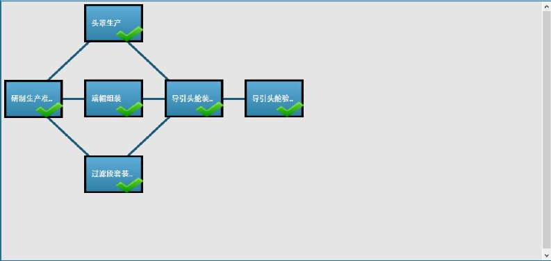

# CosimRisk

### abstract:
  Complex projects have a long construction period, limited resources and many uncertain factors. Project risk assessment is the key to success of projects, and schedule risk analysis is an indispensable part of it.
  
### object and solved problem:  
  This system is to evaluate schedule risk of a project by modeling the project into an weighted oriented graph and figure out critical path (at least how many days should be taken in project) by topological sort. Moreover, In order to sever more users, this system is designed according to MVC architecture, so we used oracle 10g as database and used HTML and Ext/Js to create front-end.

