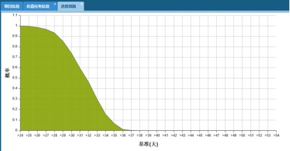
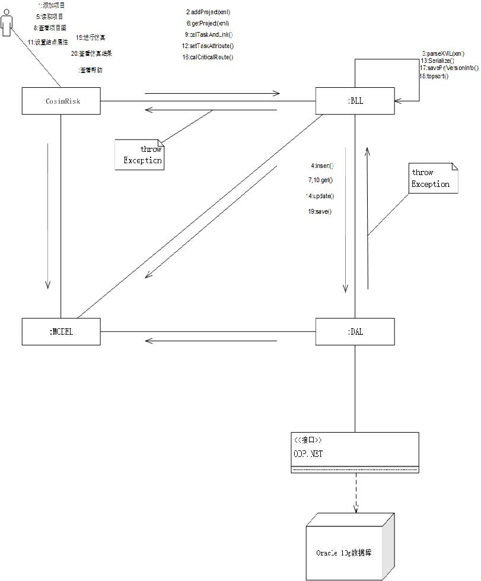

# CosimRisk

### Abstract:
  Complex projects usually have a long construction period, limited resources and many uncertain factors. Project risk assessment is the key to success for projects, and schedule risk analysis is an indispensable part of it.
  
### Object and Result:
  The system is to evaluate schedule risk of a project by modeling the project into an weighted oriented graph and figure out critical path (at least how many days should be taken in project) by topological sort. Moreover, In order to sever more users, this system is designed according to MVC architecture, so we used oracle 10g as database and used HTML and Ext/Js to create front-end.
  
  The system parses the XML file of projectand transform it into weighted oriented graph constructed by tasks (the rectangles in the Fig.1). In order to find out critical path, The system topologically sorts them from top to end and calculates expectation of schedule days in the  same time. Then again topologically sort them from end to top, comparing whther the expectation of schedule days is thesame as top-end sequence. the tasks have same value mean that them are fixed and can not be shifted. Therefore, We find out the critical path.

Fig.1 Project’s oriented graph (Chinese interface version)

Fig.2 the probability of project schedule that days are over the threshold

### Architecture:
In this System, we use MVC (Model View Controller) model. MODEL module manages all data structure and the View manages all display
pages toward to users, namely CosimRisk module in this system. Refer to Controller, BLL module manages all logical business processes and DAL module manages all operations on database. The user can interact with this system through geting and posting data with the
website named ConsimRisk, and ConsimRisk will pass data to BLL based on data models. Then BLL will deal with some requirements of the user, operating database through DAL in the same time. After that, BLL will visualize processed data and display it on CosimRisk.
The following diagram dscribes the process structure of this system. 

